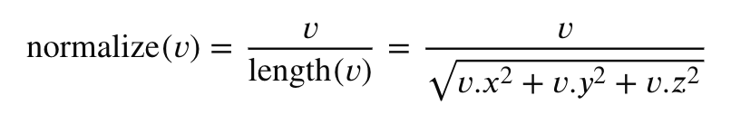
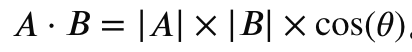
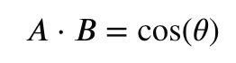
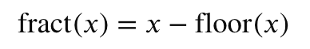

## normalize 向量归一化

核心作用是将一个非零向量转换成方向相同但长度（模长）为 1 的单位向量

### 数学原理与底层实现

在数学上，normalize(v) 的执行逻辑等于向量除以它自身的长度：



- 保持方向：归一化不会改变向量在空间中的指向。
- 缩放长度：处理后的新向量长度永远等于 1.0。
- 潜在风险：如果传入的向量是零向量（长度为 0），会导致除以零的错误，从而产生未定义行为（如得到 NaN）

### 💡 核心应用场景

#### 简化光照计算（点积与夹角余弦）

  在计算冯氏光照模型（Phong Lighting）等经典光照时，需要利用向量点积（dot）来计算夹角余弦值。根据点积公式：
  
  
  
  如果向量 A（如法线向量）和 B（如光照方向向量）全部经过 normalize() 归一化，它们的大小 |A| 和 |B| 就都等于 1。此时，公式直接简化为：

  

  这免去了繁琐的长度除法，能让 GPU 极快地计算出光照强度。

#### 修正顶点插值带来的法线畸变

  在顶点着色器（Vertex Shader）中，每个顶点的法线即使是单位向量，但在经过光栅化并插值（Interpolation）传递到片元着色器（Fragment Shader）后，插值得到的中间法线向量长度通常会小于 1。因此，为了保证光照计算的准确性，必须在片元着色器中对输入的法线再次进行 normalize()。

  如 fragmentShaders/33.js.

#### 剥离大小，纯粹表示方向

在 3D 渲染中，诸如视线方向（View Direction）、反射光方向（Reflection）、折射光方向（Refraction） 等，我们往往只需要知道它们“往哪边指”，而不关心“距离有多远”。使用 normalize() 可以剔除距离带来的权重干扰。

## pow

作用是计算一个底数的指定次幂。也就是数学中的：\(y = x^a\).

- x (底数)：要进行幂运算的数。
- y (指数)：幂次。
- 分量变体：如果传入向量，它会对向量的每个分量（x, y, z, w）分别独立计算。
- ⚠️ 极重要限制：如果底数 x 小于 0，或者底数 x 等于 0 且指数 y 小于等于 0，运算结果是未定义的（通常会导致画面花屏、变黑或报错）。

### 核心应用场景

#### 镜面高光计算（Specular Highlight）

在冯氏光照模型（Phong）中，镜面高光的集中程度（反光度/粗糙度）就是靠 pow() 来控制的。
- 指数（y）越大，高光点越小、越锐利（显得材质越光滑，如镜子、金属）。
- 指数（y）越小，高光点越大、越分散（显得材质越粗糙，如塑料、皮肤）。

#### Gamma 校正（色彩空间转换）

人眼对暗部细节比亮部更敏感，为了在线性空间（Linear）和屏幕显示的 sRGB 空间之间转换，需要进行 Gamma 校正。
- Gamma 编码（写入屏幕）：颜色的 1.0 / 2.2 次幂。
- Gamma 解码（读取纹理）：颜色的 2.2 次幂。

#### 控制渐变边缘（边缘发光 / 菲涅尔效应）

在制作菲涅尔（Fresnel）边缘发光效果时，可以用 pow() 来控制发光边缘的厚度和淡出速度。

如 fragmentShaders/33.js.

## dot

在 GLSL 中，dot() 函数的作用是计算两个向量的点积（Dot Product，又称数量积或内积）。

它的核心物理意义是：__衡量两个向量在方向上的“相似度”或“接近程度”__。

### 💡 核心应用场景

#### 计算漫反射光照（Lambert 光照模型）

光线越垂直照射在物体表面，表面就越亮。我们可以通过计算法线向量（N）和光照方向向量（L）的点积来决定亮度。

``` glsl
vec3 N = normalize(v_Normal);
vec3 L = normalize(lightDir);

// 点积结果即为光照强度
// max(..., 0.0) 用于防止点积为负数（即光线从背面射入）导致颜色异常
float diffuse = max(dot(N, L), 0.0);
vec3 finalColor = textureColor * diffuse;
```

#### 计算菲涅尔效应（Fresnel Effect，边缘发光）

菲涅尔效应常用于制作气泡、玉石、水面或科幻护盾。当视角与物体表面法线垂直时（即看模型的边缘），边缘发光最强。

``` glsl
vec3 N = normalize(v_Normal);
vec3 V = normalize(viewDir); // 视线方向

// dot(N, V) 越接近 0，说明越接近模型边缘
float edge = 1.0 - max(dot(N, V), 0.0); 

// 可以 pow() 调整边缘厚度
float fresnel = pow(edge, 3.0); 
```

#### 计算向量的长度（性能优化）

在 GPU 中，直接计算向量长度 length(v) 需要用到开平方（sqrt），这很消耗资源。而在很多算法中（如距离裁剪、粒子效果），我们只需要比较大小，这时可以用 dot(v, v) 来代替，它等于长度的平方.


## fract

作用是返回一个数的小数部分（Fractional part）.

核心物理意义是：__将无限延伸的数值，强行约束并循环映射到 [0.0, 1.0) 的区间内__。

### 数学原理与底层实现

数学定义非常简单，就是__用原数减去向下取整（floor）后的数__：



__🎯 核心规律与正负号行为__：
- 正数：fract(3.14) 结果是 0.14；fract(5.0) 结果是 0.0。
- 负数：因为 floor(-0.5) 是 -1.0，所以 fract(-0.5) = -0.5 - (-1.0) = 0.5。
- 输出范围：无论输入多大或多小的数（正负均可），输出结果永远在 __[0.0, 1.0)__ 之间。

### 💡 核心应用场景

fract() 是 Shader 中制作__重复图案、动画纹理和随机噪声__的绝对核心函数。

#### 制作重复的平铺图案（Tiling / Repeating）

如果你想在屏幕上重复绘制某种图案（比如砖墙、网格、棋盘），可以通过 fract() 强行把连续的 UV 坐标切割成无数个 0.0 到 1.0 的循环区间。

``` glsl
// 将 UV 坐标放大 10 倍，UV 范围变成 0.0 到 10.0
vec2 tiledUV = v_Uv * 10.0; 

// 使用 fract 限制回 0.0 到 1.0 之间
// 这会在水平和垂直方向上各重复绘制 10 次纹理
vec2 localUV = fract(tiledUV); 

vec4 texColor = texture(u_Texture, localUV);
```

#### 实现随时间滚动的动画（Time Loop）

配合内置变量 u_time（时间标量），fract() 可以让特效在固定周期内不断循环。例如实现从上到下不断流动的瀑布、下雨、扫描线等效果。

``` glsl
// 随着时间推移，y 坐标不断增加
float scrollingY = v_Uv.y + u_time * 0.5;

// fract 保持进度永远在 0.0 到 1.0 之间循环，形成无限滚动的扫描线
float lineProgress = fract(scrollingY); 
```


#### 伪随机数与噪声生成（Pseudo-random / Noise）

在 GPU 中没有原生的随机数函数。Shader 开发者常用 fract() 配合高频的正弦函数 sin() 来制造看起来杂乱无章的伪随机数（常用于下雪粒子、星空、噪点）。

如 random2D.glsl


## smoothstep

作用是__在两个指定的边界之间进行“平滑插值”__。
它的核心物理意义是：__过滤和修剪数据，将数值平滑地约束在 [0.0, 1.0] 区间内，常用于消除生硬的边缘，制造柔和的渐变、过渡或溶解效果__。

### 数学原理与底层实现

smoothstep(edge0, edge1, x) 包含三个参数：
- edge0 (下限)：渐变开始的边界。
- edge1 (上限)：渐变结束的边界。
- x (输入值)：需要被处理的输入变量（如 UV 坐标、距离等）。

__核心行为规律：__

- 如果 x <= edge0：返回 0.0。
- 如果 x >= edge1：返回 1.0。
- 如果 x 在 edge0 和 edge1 之间：返回一个从 0.0 到 1.0 之间平滑过渡的 S 型曲线值（内部使用埃尔米特多项式：\(3t^2 - 2t^3\)）。

__它与 step() 的区别：__
step(0.5, x)：非黑即白。只要小于 0.5 就是 0，大于 0.5 就是 1，边缘有锯齿（马赛克）。

smoothstep(0.4, 0.6, x)：在 0.4 到 0.6 之间有一个平滑淡入淡出的缓冲带，边缘极其丝滑。

### 💡 核心应用场景

smoothstep() 是 2D/3D 特效、转场动画以及反走样（抗锯齿）的核心利器.

#### 2D 塑形与抗锯齿（Anti-aliasing）

在 Shader 中绘制圆形、线条等几何图形时，直接用距离判断会导致边缘全都是锯齿。用 smoothstep 给边缘留出 1 到 2 个像素的微小缓冲区，就能实现完美的抗锯齿。

``` glsl
// 计算当前像素到屏幕中心的距离
float dist = length(v_Uv - vec2(0.5));

// 绘制一个半径为 0.4 的圆
// 0.39 到 0.41 之间是柔和的抗锯齿过渡带
float circle = 1.0 - smoothstep(0.39, 0.41, dist);
```

#### 炫酷的消融/溶解效果（Dissolve Effect）

配合游戏或特效中的噪声纹理（Noise），可以通过一个从 0 变到 1 的时间控制变量，实现物体表面像被火烧一样平滑消融的效果。

如 fragmentShaders/32.js.

#### 聚光灯边缘衰减（Spotlight Soft Edge）

在计算手电筒或聚光灯时，光照在超出一定夹角后应该逐渐变暗，而不是瞬间变黑。

``` glsl
float cosAngle = dot(lightDir, spotDir); // 计算夹角余弦

// 内角 0.95 处全亮，外角 0.85 处全黑，中间平滑衰减
float intensity = smoothstep(0.85, 0.95, cosAngle);
```

#### 进阶黑魔法：smoothstep 的奇妙变体

通过改变参数的组合，smoothstep 还可以实现更多神奇的效果：
- 反向淡出：smoothstep(0.8, 0.2, x)（上限比下限小，结果就会反过来，从 1 渐变到 0）。如 fragmentShaders/32.js.
- 制作亮线/光圈：结合两个 smoothstep 相减，能提取出一条平滑的线段。

``` glsl
float ring = smoothstep(0.35, 0.4, dist) - smoothstep(0.45, 0.5, dist);
```

